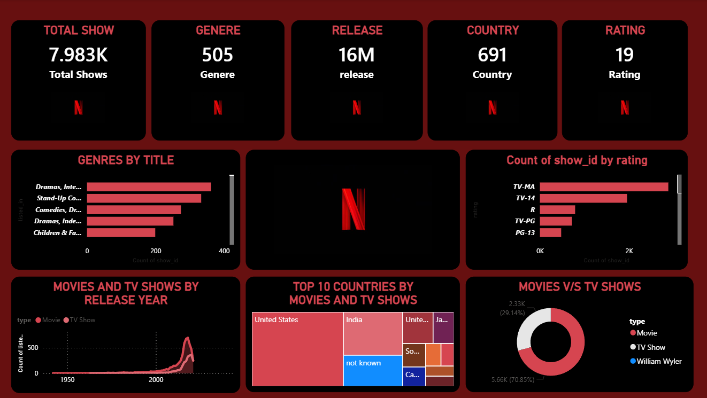

📊 Netflix Data Analysis Dashboard (Power BI)
📌 Project Overview

This project focuses on analyzing Netflix content data using Power BI to uncover insights about movies and TV shows available on the platform.
The dashboard transforms raw data into interactive visualizations to help understand content distribution, trends, and patterns across Netflix's global catalog.

🎯 Objectives

Analyze Netflix content based on genre, country, release year, and ratings

Identify the distribution between Movies and TV Shows

Visualize content growth trends over the years

Build an interactive dashboard with filters and slicers

📂 Dataset

Dataset: Netflix Titles Dataset

The dataset contains information about Netflix shows including:

Title

Director

Cast

Country

Release Year

Rating

Duration

Genre

🛠 Tools & Technologies

Power BI

Power Query

Data Visualization

Data Cleaning & Transformation

📊 Dashboard Features

✔ Interactive Slicers and Filters
✔ Multiple Dashboard Pages
✔ Visualizations for Movies vs TV Shows
✔ Country-wise content distribution
✔ Genre-based analysis
✔ Year-wise content growth

📸 Dashboard Preview
(netflix_dashboard.png)

📈 Key Insights

Movies make up a larger portion of Netflix content compared to TV Shows.

Content production has significantly increased in recent years.

Certain countries dominate Netflix content production.

Popular genres attract the majority of viewers.

🚀 Project Outcome

This project enhanced my ability to design interactive dashboards, perform data transformation, and communicate insights through visual storytelling using Power BI.

